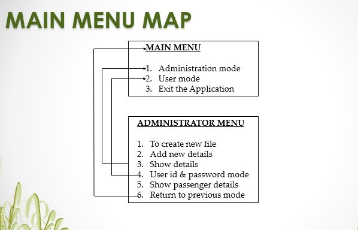
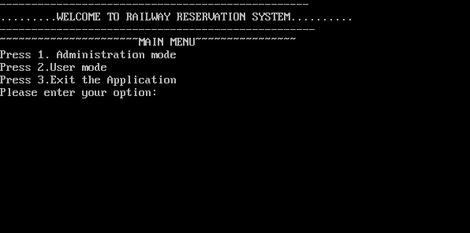
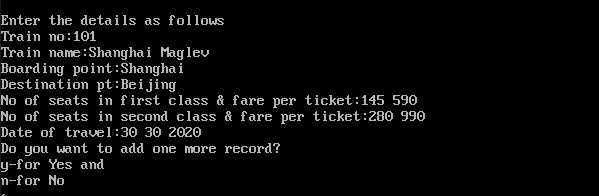
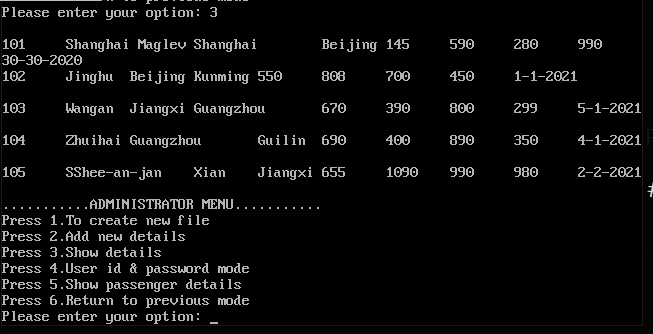
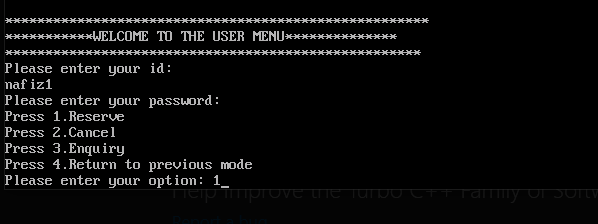

# <b>Railway Reservation System project Turbo C++</b>

_In this railway reservation system project in C++, users can get both the train details and the train reservation details. The details to be provided for train are train no., train name, boarding point, destination point, no. of seats in first class and fare per ticket, no. of seats in second class and fare per ticket and date of travel. <br/>
And, in case of reservation details, the information to be provided are train no., train name, boarding point, destination point, no. of seats required, seat class specification, date of reservation, passenger category and amount to be paid. According to the no. of seats, additional information – passenger name and passenger age are to be provided. The passenger category is divided as: military, senior citizen, children and none._

### USES OF HEADER FILES
```
#include<iostream.h>-For standard input-output stream.
#include<stdio.h>-   For basic input, output and file  handling functions
#include<conio.h>-   For getch() and clrscr() functions
#include<stdlib.h>-  For involving memory allocation, process control, etc 
#include<string.h>-  For string functions such as strcmpi()
#include<time.h>-    For time and date functions
#include<iomanip.h>- For manipulate the output C++ program
#include<fstream.h>- For using to create files, write information 
                        to files and read information from files
```

### CLASSES
```
i. login: This class is mainly made for user site. First of all, from Admin site will create id and password for user. Then user can easily access User mode.
```
```
ii. detail: This class is about the details of the train. When we add new files we need to specify the train number boarding point, Destination point, number of seats and fare per ticket and also mention Date of travel. 
```
```
iii. reser: When again we need to fill in another details. We have go to Add new file in this option. If we mention Train no, Train name, Boarding point, Destination point and number of seats add. This means that another new detail has been added to our application.
```
```
iv. canc: This class is used for cancellation system. So, the passenger mentioned Pnr no, Date of cancellation etc. This passenger details will be remove from database. 
```

## Main Menu Map


## [See more flowchart system...]((https://www.slideshare.net/secret/4ORfKjZj643bGl](https://www.slideshare.net/NafizMdImtiazUddin/turbo-c-railway-reservation-system-project-bsc-student))

<hr/>

### Here is inclued some screenshots:






## [See more screenshots...]((https://www.slideshare.net/secret/4ORfKjZj643bGl](https://www.slideshare.net/NafizMdImtiazUddin/turbo-c-railway-reservation-system-project-bsc-student))
